# Design Pattern

- [**Simple Factory**](SimpleFactory)
- [**Strategy**](Strategy)
- [**Decorator**](Decorator)
- [**Proxy**](Proxy)
- [**Factory Method**](FactoryMethod)
- [**Prototype**](Prototype)
- [**Facade**](Facade)
- [**Builder**](Builder)
- [**Observer**](Observer)
- [**Abstract Factory**](AbstractFactory)
- [**State**](State)
- [**Adapter**](Adapter)
- [**Memento**](Memento)

## 1. Simple Factory

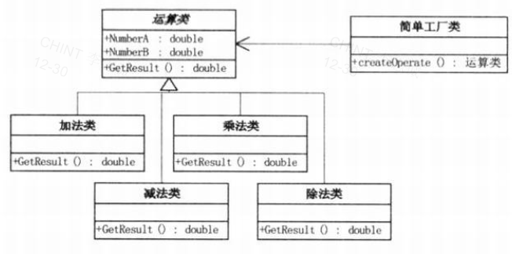

## 2. Strategy

> 定义一系列算法，把它们一个个封装起来，并且使它们可以相互替换。本模式使得算法的变化可以独立于使用算法的客户。

## 3. Decorator

> 动态地给一个对象添加一些额外的职责。就增加功能来说，装饰器模式相比生成子类更为灵活。

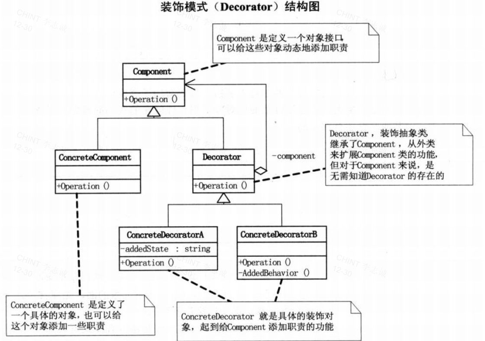

## 4. Proxy

> 为其他对象提供一种代理以控制对这个对象的访问。

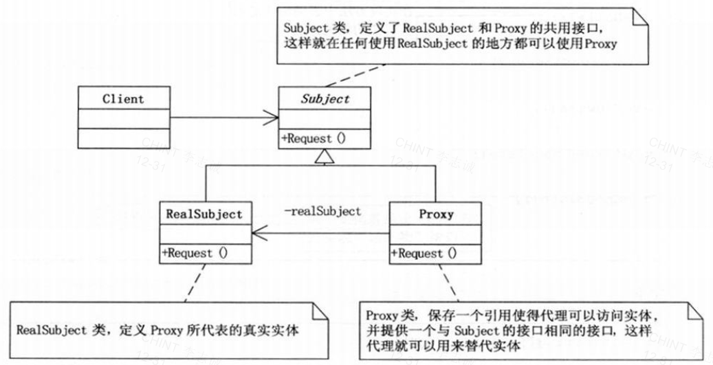

## 5. Factory Method

> 定义一个用于创建对象的接口，让子类决定实例化哪一个类。工厂方法使一个类的实例化延迟到子类。

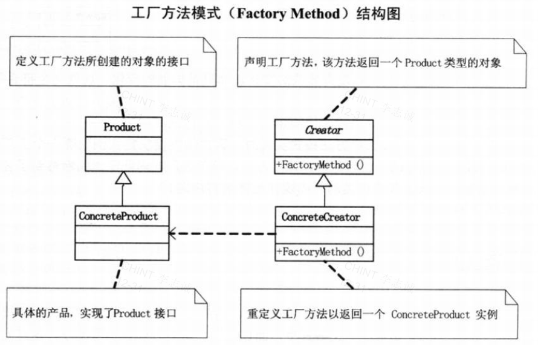

## 6. Prototype

> 用原型实例指定创建对象的种类，并且通过拷贝这些原型创建新的对象。

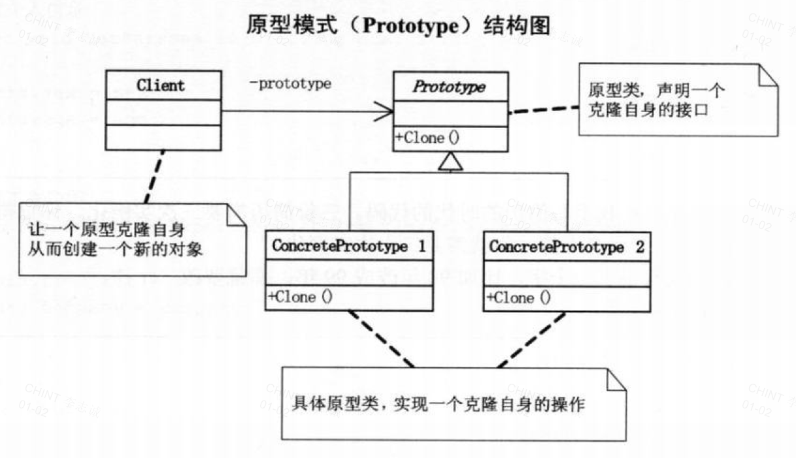

## 7. Facade

> 为子系统中的一组接口提供一个一致的界面，Facade模式定义了一个高层接口，这个接口使得这一子系统更加容易使用。

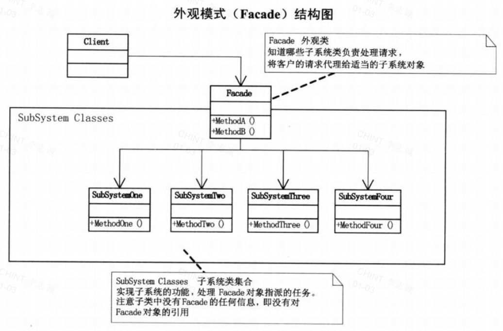

## 8. Builder

> 将一个复杂对象的构建与它的表示分离，使得同样的构建过程可以创建不同的表示。

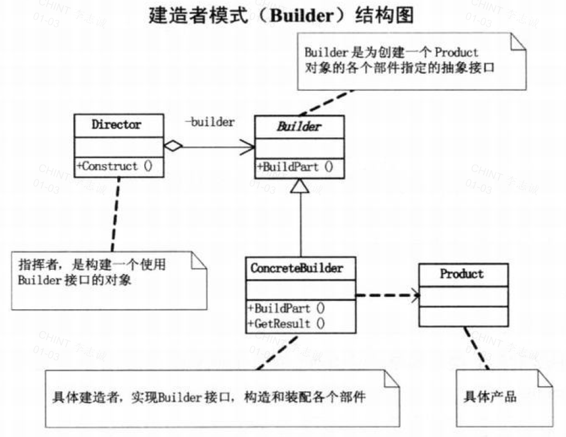

## 9. Observer

> 定义对象间的一对多依赖关系，当一个对象改变状态时，所有依赖于它的对象都会得到通知并自动更新。

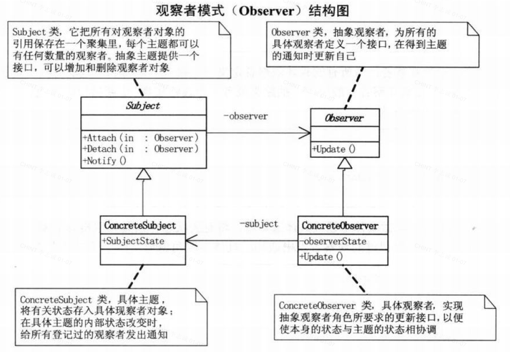

## 10. Abstract Factory

> 提供一个创建一系列相关或相互依赖对象的接口，而无需指定它们具体的类。

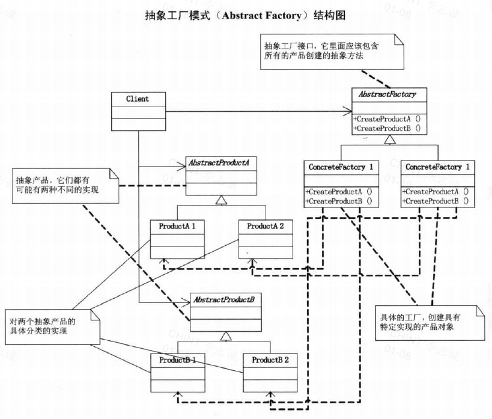

## 11. State

> 允许一个对象在其内部状态改变时改变它的行为。对象看起来似乎修改了它的类。

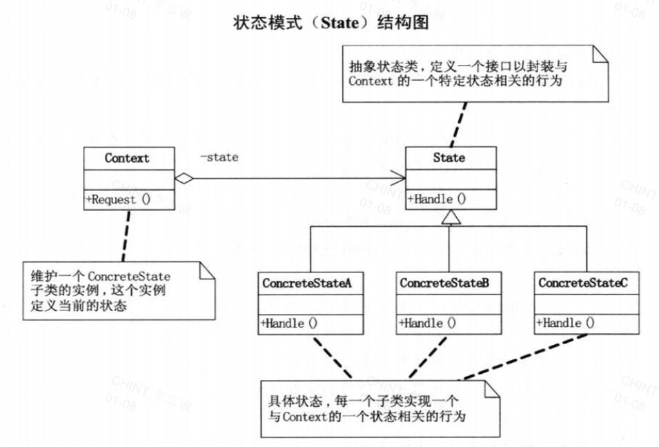

## 12. Adapter

> 将一个类的接口转换成客户希望的另外一个接口。Adapter模式使得原本由于接口不兼容而不能一起工作的那些类可以一起工作。

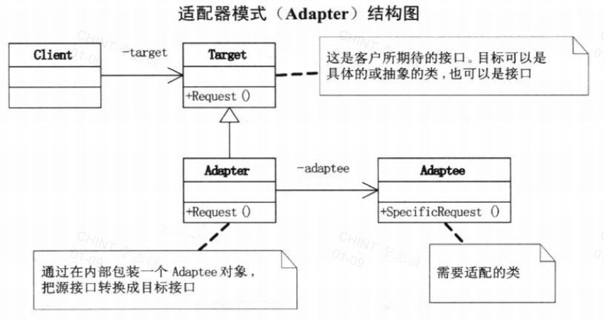

## 13. Memento

> 在不破坏封装性的前提下，捕获一个对象的内部状态，并在该对象之外保存这个状态。这样以后就可将该对象恢复到原先保存的状态。

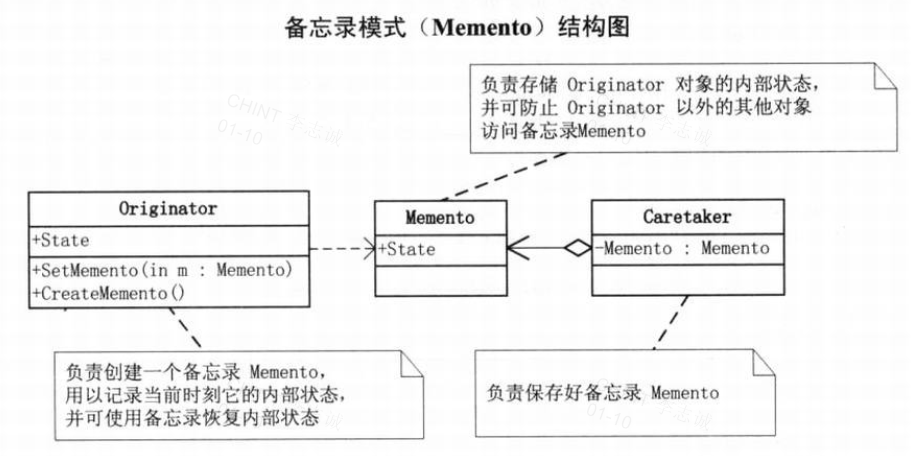

## Reference

- [*Modern C++ Design Patterns Tutorial*](https://www.geeksforgeeks.org/modern-c-design-patterns-tutorial/)
- [*Big Talk Design Pattern*](https://gitee.com/ChesterLeeRepo/book-shelf/blob/master/CommonSoftwareDesign/%E5%A4%A7%E8%AF%9D%E6%95%B0%E6%8D%AE%E7%BB%93%E6%9E%84%20(%E7%A8%8B%E6%9D%B0%E8%91%97)%20(Z-Library).pdf)
