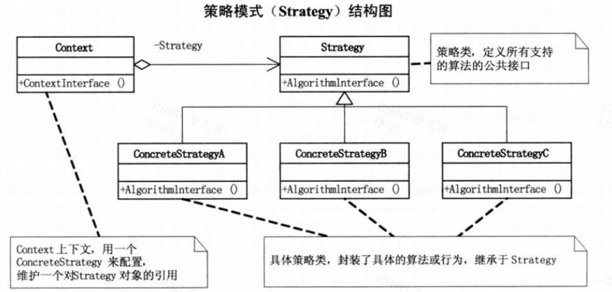

# Design Pattern

- [**Simple Factory**](SimpleFactory)
- [**Strategy**](Strategy)
- [**Decorator**](Decorator)

## 1. Simple Factory

## 2. Strategy

## 3. Decorator

## Reference

- [*Modern C++ Design Patterns Tutorial*](https://www.geeksforgeeks.org/modern-c-design-patterns-tutorial/)
- [*Big Talk Design Pattern*](https://gitee.com/ChesterLeeRepo/book-shelf/blob/master/CommonSoftwareDesign/%E5%A4%A7%E8%AF%9D%E6%95%B0%E6%8D%AE%E7%BB%93%E6%9E%84%20(%E7%A8%8B%E6%9D%B0%E8%91%97)%20(Z-Library).pdf)
